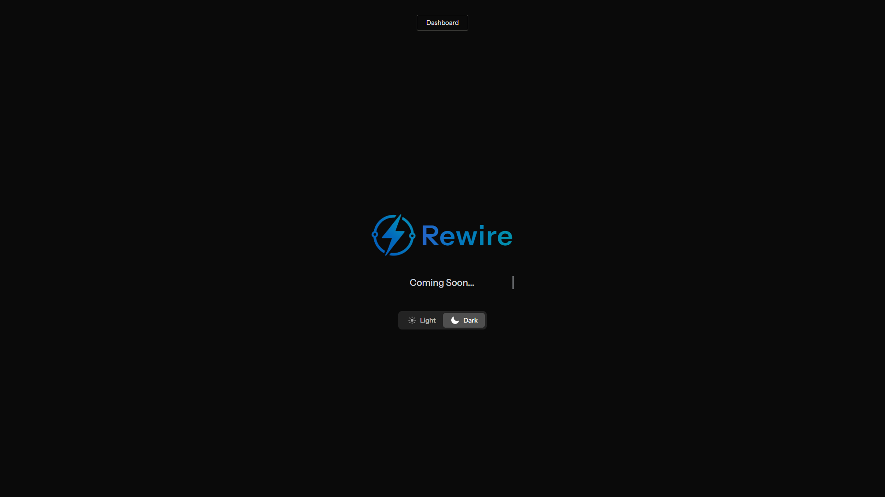

# Rewire

[](https://laravel.com)
[](https://livewire.laravel.com)
[](https://fluxui.dev)
[](https://tailwindcss.com)
[](LICENSE)

**Rewire** is a modern Laravel starter template that demonstrates best practices for building interactive web applications. It combines Laravel 12's latest features with Livewire 3, Flux UI components, and modern development workflows to provide a solid foundation for user management systems.

---

## ✨ Preview



---

## 🚀 Features

### Core Application
- **Complete Authentication System**: Registration, login, password reset, email verification
- **User Management**: Profile management with avatar uploads, personal information, and settings
- **Role-Based Access Control**: Three-tier system (super-admin, admin, user) with policy-based authorization
- **Administrator Panel**: User management interface for administrators
- **Modern UI**: Responsive interface built with Flux UI components
- **Real-time Interactivity**: Livewire components with reactive updates
- **Settings System**: Modular settings for profile, password, and appearance

### Technical Stack
- **Laravel 12.x** - Latest framework with modern PHP 8.2+ features
- **Livewire 3.x** - Full-stack reactive components
- **Livewire Volt 1.7.x** - Single-file component architecture
- **Flux UI 2.x** - Modern component library (Free edition)
- **Tailwind CSS 4.x** - Utility-first CSS framework
- **Pest 3.x** - Modern testing framework
- **Spatie Laravel Permission** - Role and permission management
- **SQLite/MySQL** - Flexible database support

---

## 📦 Installation

### Prerequisites
- PHP 8.2+
- Composer
- Node.js & npm
- Git

### Setup Instructions

```bash
# 1. Clone the repository
git clone https://github.com/zachran-recodex/rewire.git
cd rewire

# 2. Install dependencies
composer install
npm install

# 3. Environment setup
cp .env.example .env
php artisan key:generate

# 4. Database setup
touch database/database.sqlite
php artisan migrate --seed

# 5. Build assets
npm run dev
````

---

## 🛠️ Development

### Quick Start

Run everything in one command:

```bash
composer run dev
```

This launches:

* Laravel development server
* Queue worker
* Vite dev server

### Testing

```bash
php artisan test
composer test
```

### Code Quality

```bash
vendor/bin/pint
```

---

## 📁 Key Components

### Application Structure
- **Authentication System**: Complete auth flow with Laravel Breeze-style components
- **User Management**: CRUD operations with role-based permissions
- **Settings System**: Modular Volt components for user preferences
- **Admin Panel**: Administrator interface for user management

### File Organization
- `app/Livewire/` - Livewire components and forms
- `resources/views/livewire/` - Volt components for settings
- `database/seeders/` - Role and user seeders
- `tests/Feature/` - Comprehensive feature tests

---

## 🎨 User Interface

### Design System
- **Flux UI Components**: Modern component library with consistent styling
- **Responsive Design**: Mobile-first approach with Tailwind CSS
- **Dark Mode**: Complete dark/light theme support
- **Interactive Elements**: Real-time updates with Livewire

### Key Features
- Clean dashboard with sidebar navigation
- Modern authentication forms
- Settings management interface
- Administrator user management panel
- Loading states and notifications

---

## 🔐 Authentication & Authorization

### Authentication System
- Complete auth flow: registration, login, password reset, email verification
- Secure password confirmation for sensitive actions
- Session management and logout functionality

### User Features
- Profile management with avatar uploads
- Personal information and preferences
- Password updates and security settings
- Account deletion with confirmation

### Access Control
- Three-tier role system: super-admin, admin, user
- Policy-based authorization with UserPolicy
- Custom middleware for user status management
- Admin panel for user management and role assignment

---

## ⚙️ Development Features

### Testing & Quality
- Comprehensive test suite with Pest framework
- Code formatting with Laravel Pint
- GitHub Actions workflows for CI/CD
- Zero-downtime deployment setup

### Developer Experience
- Modern Laravel 12 structure
- Volt single-file components
- Hot reload with Vite
- Database seeders for quick setup

---

## 📚 Architecture Highlights

### Code Quality
- PSR-12 compliance with automated formatting
- Modern PHP 8.2+ features throughout
- Type declarations and constructor promotion
- Comprehensive test coverage

### Laravel Patterns
- Policy-based authorization
- Form request validation
- Eloquent relationships with eager loading
- Custom middleware for business logic

### Component Design
- Volt single-file components for simple features
- Class-based Livewire for complex interactions
- Reusable form objects and layouts
- Modular settings system

---

## 🚀 Deployment

### Production Build
```bash
composer install --optimize-autoloader --no-dev
npm run build
php artisan optimize
```

### Environment Configuration
Configure your `.env` file for production:

```env
APP_ENV=production
APP_DEBUG=false
DB_CONNECTION=mysql
# ... other production settings
```

See the included `.env.example` for all available configuration options.

### Database Setup
```bash
php artisan migrate --force
php artisan db:seed --force
```

---

## 🤝 Contributing

1. Fork the repository
2. Create a feature branch
3. Write tests for new features
4. Run code quality checks
5. Submit a pull request

Please follow the existing code style and include tests for new functionality.

---

## 📄 License

This project is open-sourced software licensed under the [MIT license](LICENSE).

---

## 🔗 Resources

- **Documentation**: [Laravel](https://laravel.com/docs) • [Livewire](https://livewire.laravel.com) • [Flux UI](https://fluxui.dev)
- **Repository**: [GitHub](https://github.com/zachran-recodex/rewire)

---

**Built with Laravel, Livewire, and Flux UI**  
*A modern starter template for interactive web applications*
